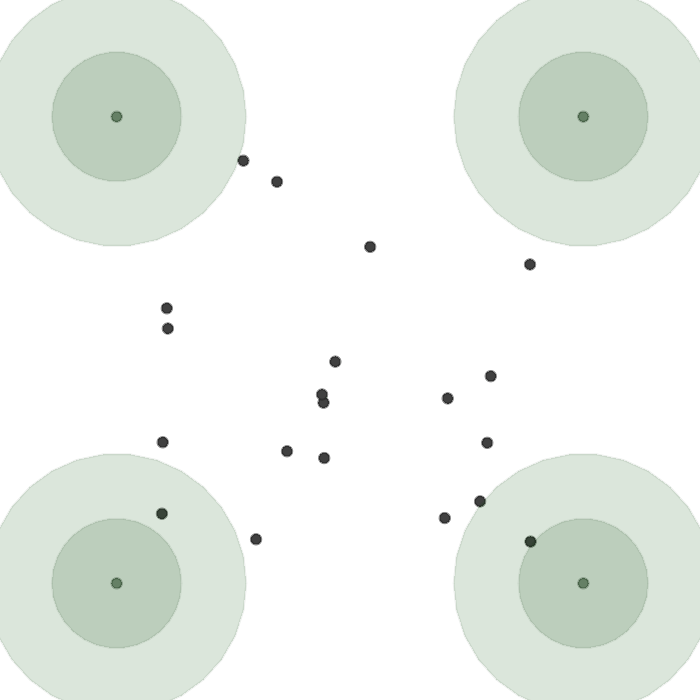
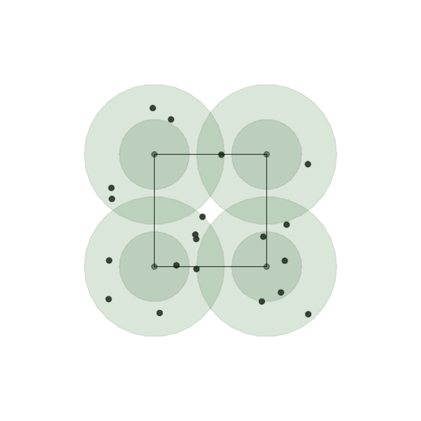
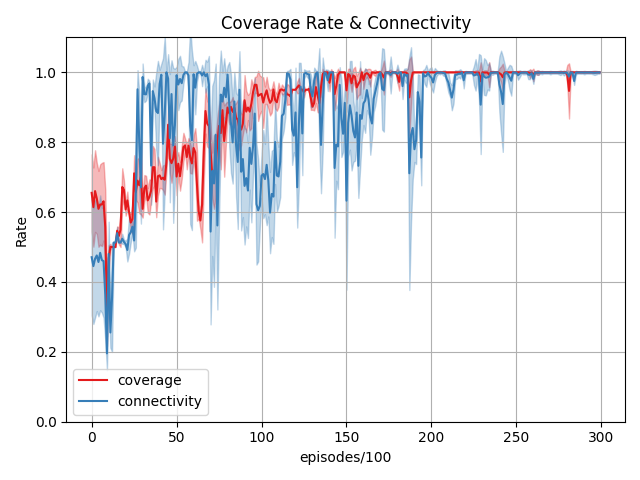
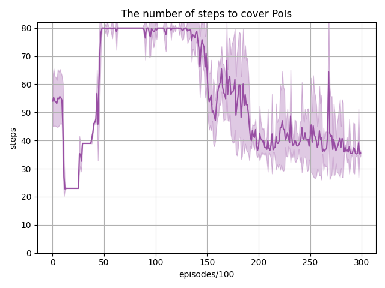
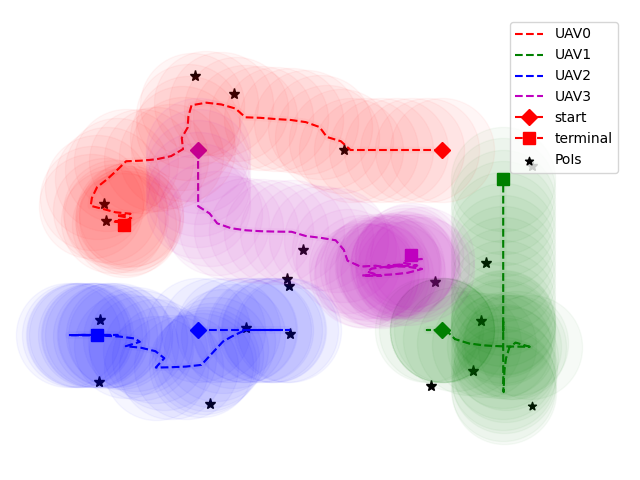

# Dynamic Coverage Control of UAV Swarm under Connectivity Preservation

基于多智能体强化学习, 本项目提供了一个面向无人机集群的动态覆盖控制方法.
我们的任务是规划无人机集群的轨迹, 使得在一段时间内, 所有PoIs都能被覆盖住.


进阶要求是无人机在执行任务时连通保持(在后续给出定义)

## 1.动态点覆盖控制的问题定义
有 $N$ 个无人机，分别为 $x_i^t$，以及 $M$ 个PoIs，分别为 $p_j$ 。
每个PoI都有特定的检测需求，而每个无人机都能在一定范围内提供检测能力。
我们使用能量和功率的概念来描述，无人机群体可以为PoI $p_j$ 提供功率，该功率值随着无人机群体的移动而变化。
随着时间的推移，点 $p_j$获得的功率将累积为能量。
当 $p_j$获得的能量大于所需能量时，任务被视为已完成。

问题定义如下,

$$
P_{i,j}^t(x^t, p_j) = M_p \exp [-(x_i^t-p_j)^2 / r^2]  , \|x_i^t-p_j\| \< r 
$$

其中,  $M_p$ 是传感器的峰值功率, $r$ 是传感器的检测半径.

$$
E^t_{N,j} = \int_0^t \sum_{i=1}^N Pow^\tau_{i,j} d\tau
$$

其中, $E^r_j$ 表示$p_j$所需的能量.
当 $\forall j, [E_{N,j}^t\geq E^r_j]$时, 任务被视为已完成.

### 强化学习环境
我们基于Multiagent-Particle-Envs构建了一个动态覆盖环境。
CoverageWorld类继承自multiagent.core.world，在其step()方法中计算功率和能量，并更新了PoI的状态(通过判断已获得功率和所需功率, 判定是否已经完成覆盖)。
scenarios中的文件描述了动态覆盖场景, 其中coverage1.py是不考虑连通保持的版本, coverage2.py是考虑连通保持的版本. 
multiagent/render.py被修改以实时显示PoIs获得的当前功率以及无人机之间的通信连通情况。
其他一些更改，比如添加保持连接性的约束条件，根据约束条件修改动作，稍后会提到。


## 2. 基于MARL的动态覆盖控制 
Agent的观测包括自身的位置和速度，以及其他agent和PoIs的相对位置, 当前能量, 所需能量, 是否完成覆盖的标志位。
Agent的动作包括前进、后退、向左、向右和保持静止。
作为一个纯粹的合作场景，所有agent的奖励都相同，并设置如下：

$$
R^t = R_{task}(\|M_d^t-M_d^{t-1}\|) + R_{done}^t + R_{dist}\sum_{j\in M_d^t} \min_i \\|x_i^t-p_j\\|_2
$$

其中， $M_d^t$ 是在时间 $t$完成的PoIs的集合，第一项表示完成单个PoI覆盖的一次性奖励；
 $R_{done}^t$是任务完成的一次性奖励，仅当任务完成时等于0；
第三项是未完成的PoIs及其最近代理之间距离的总和。
奖励的第三项非常关键，因为它作为引导项使得奖励更加密集。

## 3. 基于规则的连通保持约束
判断下一时刻若失去连通，则在失去连通的无人机之间产生连通保持力，其满足

$$
f_{r, i}=\alpha \times \ln \left(1+e^{d_{i j}^t-2 r}\right) \times \frac{x_j^t-x_i^t}{d_{i j}^t}, 
\alpha>\frac{m vel_{\max }}{\ln \left(1+e^{2 v e l_{\max } \Delta t}\right)}
$$

证明略

## 4. 结果
训练结果如下所示, (2和3是考虑连通保持的版本)

<div style="text-align: center;">
  
  
  
</div>


<div style="text-align: center;">
  
  
  
</div>

## 5. MARL 代码
基于 [MAPPO](https://github.com/marlbenchmark/on-policy) 算法的torch的代码在 [uav_dcc_control](./uav_dcc_control) 中.

### 环境配置与运行
```
conda create -n dcc python==3.9
pip3 install torch torchvision torchaudio omegaconf wandb
pip install gym==0.10.5
pip install pyglet==1.5.27  # optional for render

python train.py 0  # "0" means cuda:0, if cuda is not available, subject "0" with any int
```
其中sys变量0表示调用cuda:0, 如果cuda不可用, 则会使用cpu
